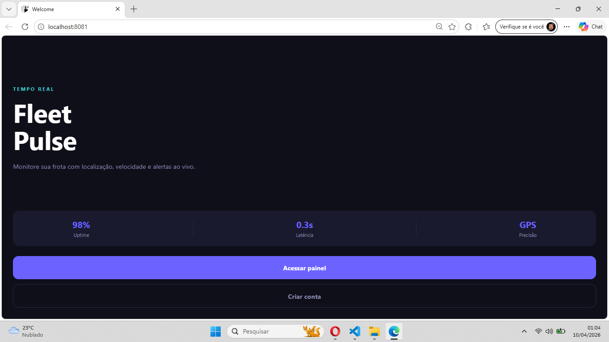
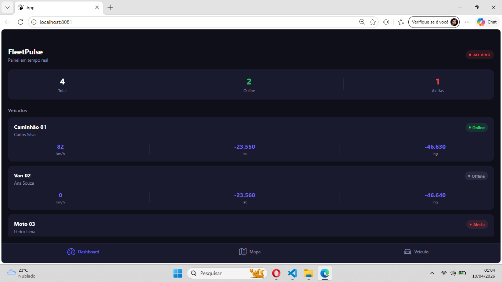
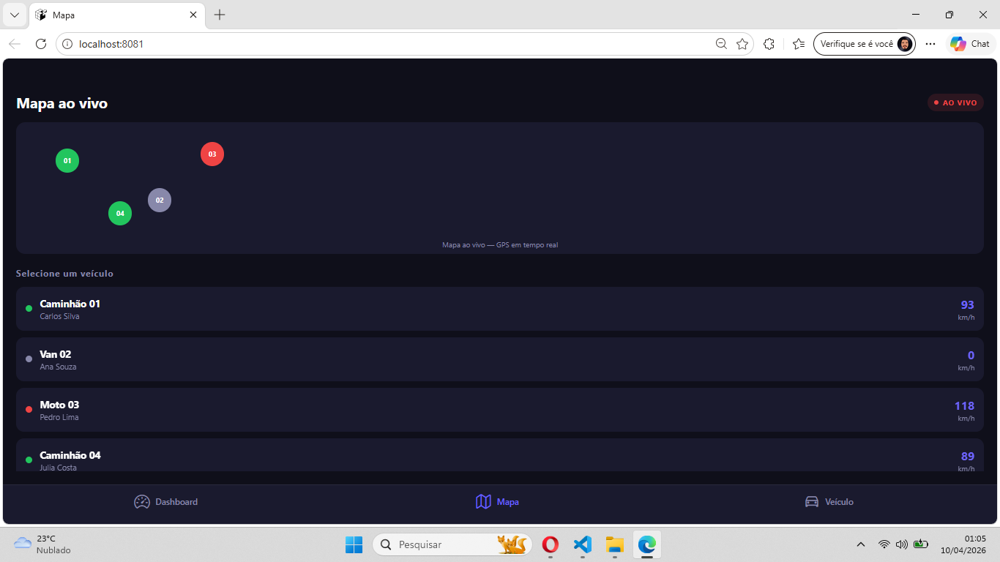
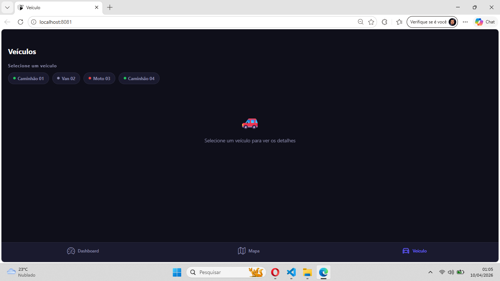

# 🚛 FleetPulse — Real-Time Fleet Monitoring


> Monitor your entire fleet in real time — location, speed, alerts and live dashboard.

---

## 📱 Screenshots

| Welcome | Dashboard | Map | Vehicle |
|--------|-----------|-----|---------|
|  |  |  |  |

---

## ✨ Features

- 🔴 **Live tracking** — vehicle data updates every 2 seconds
- 🗺️ **Real-time map** — colored markers by vehicle status
- 📊 **Speed history chart** — visual graph per vehicle
- 🚨 **Alert system** — speed limit detection (>100 km/h)
- 🌙 **Dark mode** — full dark UI design
- 📱 **Cross-platform** — works on iOS, Android and Web

---

## 🏗️ Architecture

src/
├── @types/          # TypeScript definitions
├── components/      # Reusable UI components
├── hooks/           # Custom hooks (TanStack Query)
├── routes/          # Navigation (Stack + Bottom Tabs)
├── screens/         # App screens
│   ├── Welcome/     # Landing screen
│   ├── Dashboard/   # Live fleet overview
│   ├── MapLive/     # Real-time map
│   └── Vehicle/     # Vehicle details + chart
├── services/        # Firebase config
├── store/           # Global state (Zustand)
├── theme/           # Design system (colors, fonts)
└── utils/           # Helpers and validators

---

## 🚀 Tech Stack

| Technology | Purpose |
|-----------|---------|
| React Native + Expo | Cross-platform mobile app |
| TypeScript | Type safety |
| Firebase Realtime DB | Live data sync |
| Zustand | Global state management |
| TanStack Query | Data fetching & caching |
| React Navigation | Stack + Tab navigation |
| MMKV | Local persistence |
| Zod | Schema validation |

---

## ⚙️ Getting Started

```bash
# Clone the repository
git clone https://github.com/claytonmarcelo/FleetPulse.git

# Install dependencies
cd FleetPulse
npm install

# Start the project
npx expo start
```

---

## 📋 Environment Variables

Create a `.env` file in the root directory:

```env
FIREBASE_API_KEY=your_api_key
FIREBASE_AUTH_DOMAIN=your_project.firebaseapp.com
FIREBASE_DATABASE_URL=https://your_project.firebaseio.com
FIREBASE_PROJECT_ID=your_project_id
```

---

## 👨‍💻 Author

**Clayton Marcelo**  
[](https://linkedin.com/in/claytonmarcelo)
[](https://github.com/claytonmarcelo)

---

## 📄 License

MIT License © 2026 Clayton Marcelo
Depois crie a pasta docs na raiz e coloque os prints das telas lá com os nomes welcome.png, dashboard.png, map.png e vehicle.png.
